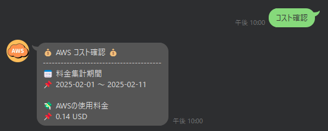
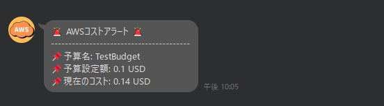
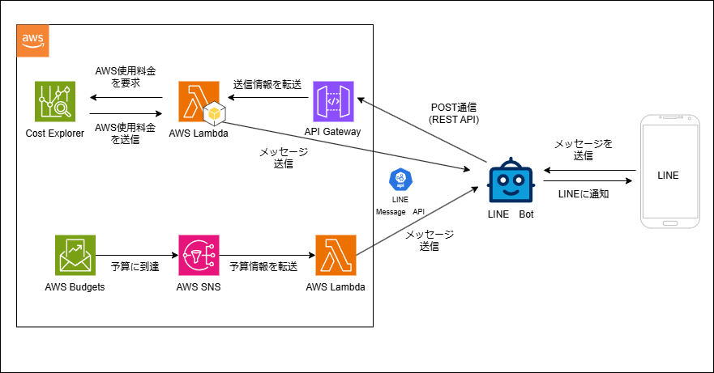

# LINEにAWSの使用料金を通知する

# 実際の動作

## リプライ機能

## コストアラート機能(自動通知)

# 機能
- 特定のキーワードが送信された場合、現在のAWS使用料金をリプライ
- AWSの使用料金が予算額を超えた場合に自動通知

# アーキテクチャ図

# 構成

<pre>
📦
 ┣ 📂images
 ┃ ┣ 📜AWS.png
 ┃ ┣ 📜LINEのAWSコスト通知.png
 ┃ ┣ 📜notify.png
 ┃ ┗ 📜reply.png
 ┣ 📂notify　-> コスト通知用
 ┃ ┣ 📂utils
 ┃ ┃ ┗ 📜constants.py
 ┃ ┣ 📜lambda_function.py
 ┃ ┗ 📜test-sns-message.json　-> SNSのテストデータ
 ┣ 📂reply -> 現在のコスト確認用
 ┃ ┣ 📂utils
 ┃ ┃ ┗ 📜constants.py
 ┃ ┗ 📜lambda_function.py
 ┣ 📜LINEのAWSコスト通知.drawio
 ┣ 📜.gitignore
 ┗ 📜READEME.md
</pre>
